# VitaNomy — AI Clinical Health Digital Twin

> **"Synchronizing human physiology with clinical intelligence for high-fidelity longevity."**

VitaNomy is a full-stack Next.js 16 clinical intelligence platform. It builds a real-time **AI Digital Twin** of a user's physiology — tracking Diabetes, Cardiac, and Hypertension risk for general patients, and Cardiovascular, Hepatotoxicity, Endocrine Suppression, and Hematological risk for athletes — then simulates how lifestyle and therapeutic choices alter their future health trajectory.

---

## Table of Contents

1. [Project Overview](#1-project-overview)
2. [Tech Stack](#2-tech-stack)
3. [Directory Structure](#3-directory-structure)
4. [Architecture Overview](#4-architecture-overview)
5. [Data Models & Types](#5-data-models--types)
6. [Global State Management](#6-global-state-management)
7. [API Routes — Complete Reference](#7-api-routes---complete-reference)
8. [Core Business Logic](#8-core-business-logic)
9. [AI Service Layer](#9-ai-service-layer)
10. [Database Schema](#10-database-schema)
11. [Frontend Pages & Flows](#11-frontend-pages--flows)
12. [Component Architecture](#12-component-architecture)
13. [Data Flow Diagrams](#13-data-flow-diagrams)
14. [Authentication Flow](#14-authentication-flow)
15. [Internationalization](#15-internationalization)
16. [Environment Variables](#16-environment-variables)
17. [Running the Project](#17-running-the-project)

---

## 1. Project Overview

VitaNomy operates in two distinct clinical modes:

| Mode | Target User | Risk Domains |
|------|------------|--------------|
| **Patient Mode** | General public / clinical patients | Diabetes · Cardiac · Hypertension |
| **Athlete Mode** | Performance athletes / bodybuilders | Cardiovascular · Hepatotoxicity · Endocrine Suppression · Hematological |

### Core Feature Set

- **Medical Intake**: Structured forms for patient biometrics and athlete compound stacks
- **Risk Engine**: Deterministic, rule-based scoring engine (no external API dependency)
- **AI Insights**: Gemini 2.0 Flash generates clinically-toned insights and recommendations
- **Scenario Simulator**: "What-if" projections for diet, exercise, medications, compound adjustments
- **Dr. Vita Chat**: Conversational AI clinical assistant with full session history context
- **PDF Extraction**: AI vision reads uploaded lab reports and auto-populates the twin
- **Clinical Dossier Export**: Print-optimized full health report

---

## 2. Tech Stack

| Layer | Technology | Version |
|-------|-----------|---------|
| Framework | Next.js (App Router) | 16.2.1 |
| Language | TypeScript | ^5 |
| UI | React | 19.2.4 |
| Styling | Tailwind CSS v4 + Vanilla CSS | ^4 |
| Animation | Framer Motion | ^12 |
| Icons | Lucide React | ^1.7 |
| 3D Visuals | Three.js + React Three Fiber | ^0.183 / ^9.5 |
| Charts | Recharts | ^3.8 |
| State | Zustand (with persist) | ^5 |
| Database | PostgreSQL via Neon DB (Serverless) | — |
| ORM | Prisma | ^6.19 |
| Auth | NextAuth v4 + Prisma Adapter | ^4.24 |
| AI (Insights/Chat/Sim) | Google Gemini API (`gemini-2.0-flash`) | ^0.24 |
| AI (PDF Extraction) | Anthropic Claude (`claude-sonnet-4`) | ^0.82 |
| Validation | Zod | ^4 |
| Password Hashing | bcryptjs | ^3 |

---

## 3. Directory Structure

```
VitaNomy/
│
├── app/                            # Next.js App Router
│   ├── layout.tsx                  # Root HTML shell + AuthProvider
│   ├── page.tsx                    # Landing page (redirects to /)
│   ├── globals.css                 # Global styles + print-only CSS layer
│   │
│   ├── login/                      # Authentication: Login page
│   ├── register/                   # Authentication: Registration page
│   ├── account/                    # User profile & settings hub
│   ├── chat/                       # Dr. Vita conversational interface
│   ├── simulator/                  # Scenario simulation engine UI
│   ├── dashboard/                  # Main clinical dashboard (DELETED in latest refactor)
│   ├── athlete/                    # Athlete-mode dashboard
│   │
│   └── api/                        # Next.js API Routes (Server-side)
│       ├── analyze/route.ts        # POST /api/analyze
│       ├── simulate/route.ts       # POST /api/simulate
│       ├── chat/route.ts           # POST /api/chat
│       ├── extract/route.ts        # POST /api/extract (PDF vision)
│       ├── history/route.ts        # GET  /api/history
│       ├── threats/route.ts        # GET  /api/threats
│       └── auth/
│           ├── [...nextauth]/      # NextAuth dynamic catch-all handler
│           └── register/           # POST /api/auth/register (credential signup)
│
├── components/
│   ├── Chat/
│   │   ├── ChatBox.tsx             # Full message thread renderer
│   │   └── SuggestedChips.tsx      # Quick-reply suggestion buttons
│   │
│   ├── Common/
│   │   └── TypoAvatar.tsx          # Initials-based user avatar
│   │
│   ├── Dashboard/
│   │   ├── BodyHeatmap.tsx         # Body silhouette risk heatmap
│   │   ├── InsightsList.tsx        # AI insight cards list
│   │   ├── PatientBanner.tsx       # Patient summary header strip
│   │   └── RiskGauge.tsx           # Circular risk percentage gauge
│   │
│   ├── Form/
│   │   ├── PatientForm.tsx         # Full medical intake multi-step form
│   │   └── CompoundLogForm.tsx     # Athlete compound/steroid log entry
│   │
│   ├── Landing/
│   │   ├── Navbar.tsx              # Marketing site navigation
│   │   ├── Hero.tsx                # Hero section
│   │   ├── Features.tsx            # Feature grid
│   │   ├── HowItWorks.tsx          # Process walkthrough
│   │   ├── DataTwin.tsx            # Digital twin explainer
│   │   ├── Marquee.tsx             # Scrolling tech/partner marquee
│   │   └── Footer.tsx              # Site footer
│   │
│   ├── Layout/
│   │   └── Topbar.tsx              # App-wide navigation bar (app shell)
│   │
│   ├── Providers/
│   │   └── AuthProvider.tsx        # NextAuth SessionProvider wrapper
│   │
│   ├── Simulator/
│   │   ├── RiskGauge.tsx           # Simulator-specific risk gauge (before/after)
│   │   ├── DeltaComparison.tsx     # Risk delta visualization (Δ points)
│   │   ├── ScenarioCard.tsx        # Clickable scenario option card
│   │   └── SimulatorBody.tsx       # 3D body model for athlete simulation
│   │
│   └── Visuals/                    # Abstract visual/3D components
│
├── lib/
│   ├── riskEngine.ts               # Core deterministic risk scoring (no API)
│   ├── claudeService.ts            # Gemini AI service (insights, chat, narrative)
│   └── db.ts                       # Prisma client singleton
│
├── store/
│   └── patientStore.ts             # Zustand global state + persist middleware
│
├── types/
│   └── patient.ts                  # All TypeScript interfaces & union types
│
├── prisma/
│   └── schema.prisma               # Database schema (PostgreSQL/Neon)
│
├── locales/
│   └── translations.ts             # i18n strings (EN, HI, TA, TE)
│
├── data/                           # Static mock/demo data files
├── hooks/                          # Custom React hooks
├── public/                         # Static assets
│
├── .env                            # Environment variables (local)
├── next.config.ts                  # Next.js configuration
├── tailwind.config.ts              # Tailwind CSS configuration
└── package.json                    # Project manifest
```

---

## 4. Architecture Overview

```mermaid
graph TB
    subgraph "Client — Browser"
        LP[Landing Page /] --> REG[Register /register]
        LP --> LGN[Login /login]
        REG --> DASH[Dashboard / App Shell]
        LGN --> DASH
        DASH --> SIM[Simulator /simulator]
        DASH --> CHAT[Chat /chat]
        DASH --> ACC[Account /account]
    end

    subgraph "State Layer — Zustand (persisted)"
        STORE[(patientStore)]
        DASH --> STORE
        SIM --> STORE
        CHAT --> STORE
        ACC --> STORE
    end

    subgraph "Next.js API Routes (Server)"
        ANA[POST /api/analyze]
        SIM_API[POST /api/simulate]
        CHAT_API[POST /api/chat]
        EXT[POST /api/extract]
        HIST[GET /api/history]
        THR[GET /api/threats]
        AUTH_API[/api/auth/*]
    end

    subgraph "Core Services"
        RE[riskEngine.ts\nDeterministic Scoring]
        GEM[claudeService.ts\nGemini 2.0 Flash]
        ANT[extract/route.ts\nAnthropic Claude Vision]
    end

    subgraph "Data Layer"
        NEON[(Neon PostgreSQL)]
        PRISMA[Prisma ORM]
        NEON --- PRISMA
    end

    STORE -->|fetch POST| ANA
    STORE -->|fetch POST| SIM_API
    STORE -->|fetch POST| CHAT_API
    ACC -->|fetch POST| EXT
    DASH -->|fetch GET| HIST
    DASH -->|fetch GET| THR

    ANA --> RE
    ANA --> GEM
    ANA --> PRISMA

    SIM_API --> RE
    SIM_API --> GEM

    CHAT_API --> GEM

    EXT --> ANT

    PRISMA --> NEON
    AUTH_API --> PRISMA
```

---

## 5. Data Models & Types

All core TypeScript types are defined in `types/patient.ts`.

### Platform Mode
```typescript
type PlatformMode = 'patient' | 'athlete' | 'dashboard' | 'simulator'
```

### Patient Mode Input (`PatientInput`)

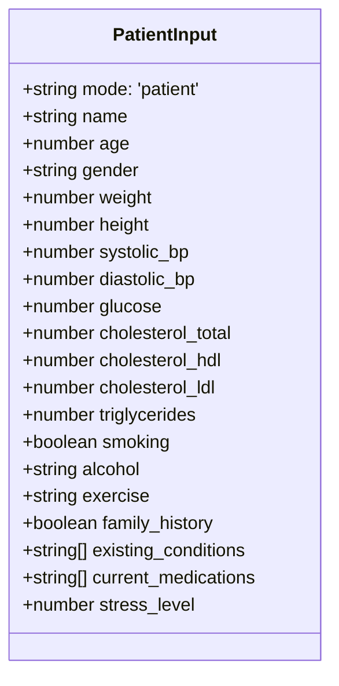

### Athlete Mode Input (`AthleteInput extends PatientInput`)

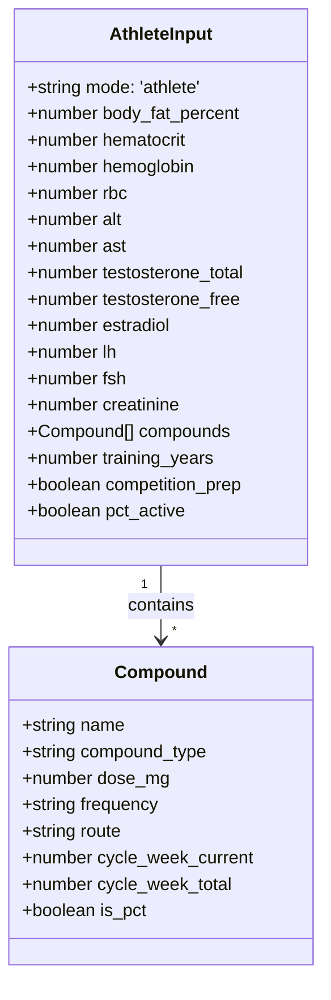

### Risk Output Types

| Type | Risk Factors |
|------|-------------|
| `PatientRiskScores` | `diabetes`, `cardiac`, `hypertension` — each a `RiskFactor` |
| `AthleteRiskScores` | `cardiovascular`, `hepatotoxicity`, `endocrine_suppression`, `hematological` — each a `RiskFactor` |
| `RiskFactor` | `score: number`, `confidence`, `confidence_interval: [low, high]`, `primary_drivers: string[]` |

### API Response Types

| Interface | Key Fields |
|-----------|-----------|
| `AnalyzeResponse` | `patient_id`, `mode`, `risk_scores`, `overall_risk`, `insights[]`, `recommendations[]`, `causation_flags?[]`, `data_completeness` |
| `SimulateResponse` | `original_risks`, `projected_risks`, `delta: {[key]: number}`, `narrative: string`, `timeframe` |
| `ExtractResponse` | `mode`, `extracted_fields`, `unreadable_fields[]`, `confidence` |
| `ChatMessage` | `role: 'user'\|'assistant'`, `content`, `time?`, `qr?[]`, `contextSnippet?` |

---

## 6. Global State Management

VitaNomy uses a single **Zustand** store persisted to `localStorage` under key `vitanomy-storage`.

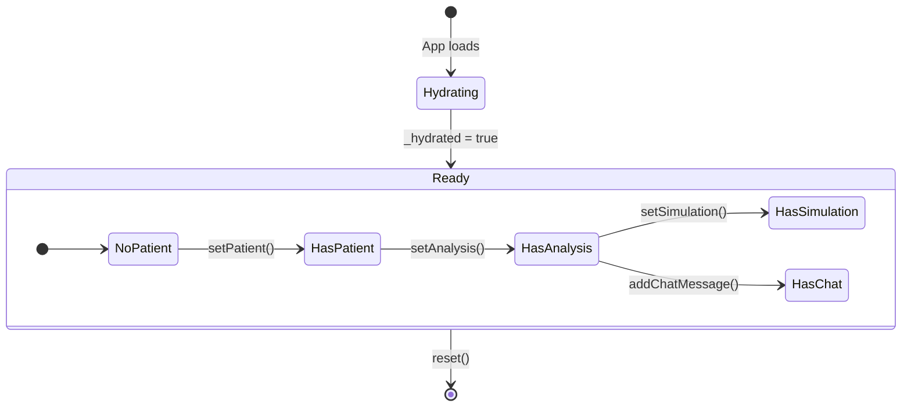

### Store Slice Overview

| Slice | Fields | Actions |
|-------|--------|---------|
| **Hydration** | `_hydrated` | `setHydrated()` |
| **Mode** | `mode`, `isAthlete` | `setMode()`, `setIsAthlete()` |
| **Patient** | `patient: AnyPatientInput \| null` | `setPatient()`, `updatePatient()` |
| **Extract** | `extractResult: ExtractResponse \| null` | `setExtractResult()` |
| **Analysis** | `analysis: AnalyzeResponse \| null` | `setAnalysis()` |
| **Simulation** | `simulation: SimulateResponse \| null`, `simulationParams: SimulationParams \| null` | `setSimulation()`, `setSimulationParams()` |
| **Chat** | `chatHistory: ChatMessage[]` | `addChatMessage()`, `clearChat()` |
| **Loading** | `loadingExtract`, `loadingAnalyze`, `loadingSimulate`, `loadingChat` | `setLoading(key, bool)` |
| **Error** | `error: string \| null` | `setError()` |
| **Language** | `language: 'en'\|'hi'\|'ta'\|'te'` | `setLanguage()` |

### `SimulationParams` Structure

```typescript
interface SimulationParams {
  // Patient fields
  cal: number         // Daily calories
  carb: number        // Daily carbs (g)
  sodium: number      // Daily sodium (mg)
  exercise: number    // Sessions per week
  sleep: number       // Hours per night
  stress: number      // Stress level 1-10
  isSmoker: boolean
  isMeds: boolean
  timeline: string    // '1M' | '3M' | '6M' | '1Y'
  // Athlete-specific
  simAlt?: number
  simHematocrit?: number
  simCompounds?: Compound[]
  isPct?: boolean
}
```

---

## 7. API Routes — Complete Reference

### `POST /api/analyze`

**Purpose**: Runs the complete clinical analysis pipeline for a patient or athlete.

**Request Body**: `AnyPatientInput` (full patient/athlete object)

**Pipeline**:
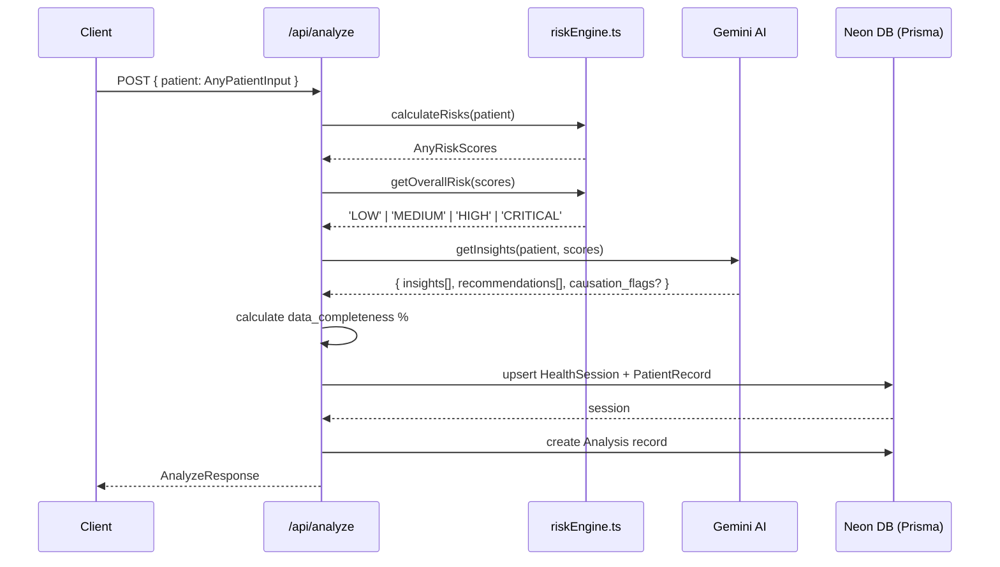

**Response**: `AnalyzeResponse`

---

### `POST /api/simulate`

**Purpose**: Projects risk scores under a modified clinical scenario.

**Request Body**: `{ patient: AnyPatientInput, scenario: string, modifiedPatient?: AnyPatientInput }`

**Scenarios**:

| Patient Scenarios | Athlete Scenarios |
|-------------------|-------------------|
| `exercise` — sets exercise to moderate, cuts weight 3% | `reduce_dose` — halves all compound doses |
| `diet` — cuts glucose 12%, cholesterol 8%, triglycerides 15% | `add_organ_support` — cuts ALT/AST 25% |
| `quit_smoking` — sets smoking false, −6mmHg systolic | `start_pct` — enables PCT, boosts LH/FSH 80% |
| `medication` — cuts BP 12%, glucose 15% | `cycle_off` — clears compounds, enables PCT, restores LH/FSH |
| `custom` — accepts `modifiedPatient` directly | `custom` — accepts `modifiedPatient` directly |

**Pipeline**:
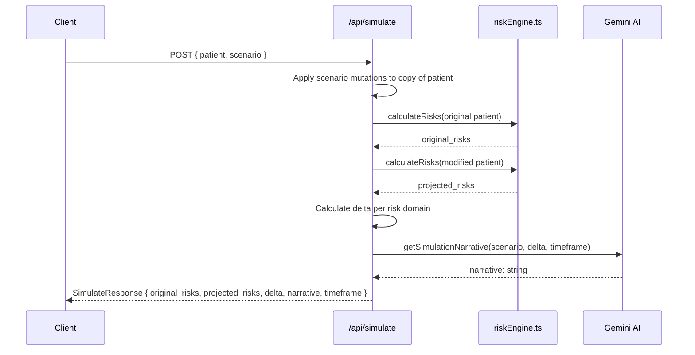

**Timeframes by Scenario**:
| Scenario | Estimated Timeframe |
|----------|-------------------|
| exercise | 3–6 months |
| diet | 2–3 months |
| quit_smoking | 6–12 months |
| medication | 4–8 weeks |
| reduce_dose | 4–6 weeks |
| add_organ_support | 2–4 weeks |
| start_pct | 4–8 weeks |
| cycle_off | 3–6 months |

---

### `POST /api/chat`

**Purpose**: Sends a message to Dr. Vita and gets a context-aware clinical AI response.

**Request Body**: `{ patient, analysis, history: ChatMessage[], message: string }`

**Flow**:
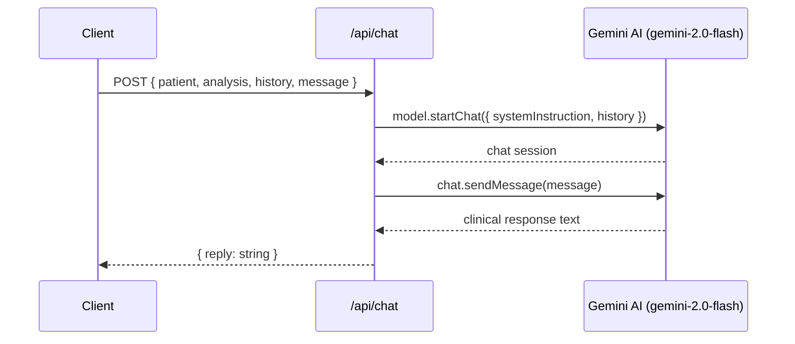

**System Persona by Mode**:
- **Patient Mode**: Dr. Vita — compassionate clinical AI, references glucose, BP, BMI; max 3-4 sentences; never prescribes
- **Athlete Mode**: Performance Health AI — harm reduction focus, references specific compounds; technical, high-performance tone

---

### `POST /api/extract`

**Purpose**: Vision AI reads a PDF lab report and returns structured medical values.

> ⚠️ **Note**: This endpoint still uses **Anthropic Claude** (not Gemini) because it requires multimodal document vision with native PDF support.

**Request Body**: `{ pdf_base64: string, mode: 'patient' | 'athlete' }`

**Flow**:
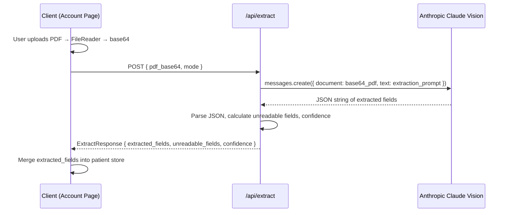

**Extracted Fields**:
- **Patient**: `systolic_bp`, `diastolic_bp`, `glucose`, `cholesterol_total`, `cholesterol_hdl`, `cholesterol_ldl`, `triglycerides`, `weight`, `height`
- **Athlete**: All patient fields + `hematocrit`, `hemoglobin`, `rbc`, `alt`, `ast`, `testosterone_total/free`, `estradiol`, `lh`, `fsh`, `creatinine`, `body_fat_percent`

**Confidence Scoring**: `>70%` fields found → high, `>40%` → medium, else → low

**Max Duration**: 60s (`export const maxDuration = 60`)

---

### `GET /api/history`

**Purpose**: Fetches the last 10 analysis sessions for a patient.

**Query Params**: `?patientId=<name-based-slug>`

**Response**: `{ sessions: Analysis[] }` — each includes the parent `HealthSession`

---

### `GET /api/threats`

**Purpose**: Returns a randomized bio-threat alert for the dashboard's live threat panel.

**Logic**: 70% probability of low/nominal threat; 30% probability of medium/high. Pure demo simulation — not based on actual patient data.

**Response**: `{ timestamp, level: 'low'|'medium'|'high', message, color }`

---

### `GET|POST /api/auth/[...nextauth]`

NextAuth.js dynamic route handling OAuth flows and credential-based sessions.

### `POST /api/auth/register`

Credential-based user registration. Hashes passwords with `bcryptjs` and stores via Prisma.

---

## 8. Core Business Logic

### Risk Engine (`lib/riskEngine.ts`)

The risk engine is **fully deterministic** — no AI, no API calls. It applies clinical thresholds to raw biomarker values to produce scored `RiskFactor` objects.

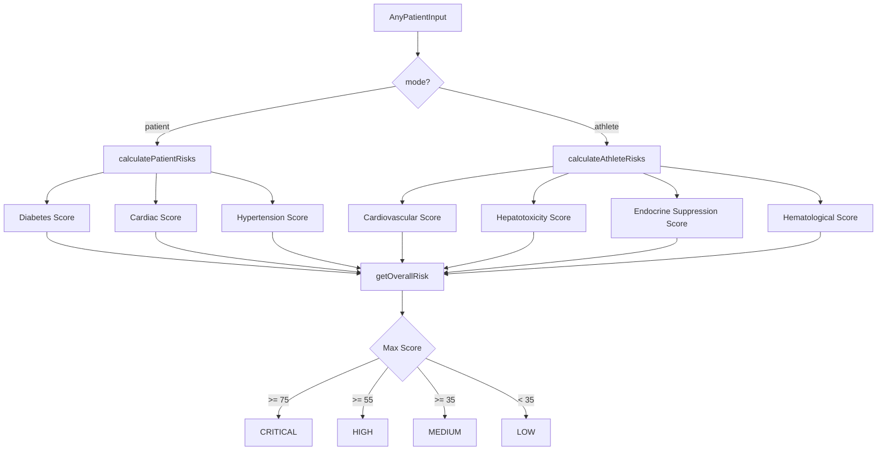

#### Patient Risk Scoring — Key Thresholds

**Diabetes Score** (max 95):
| Condition | Points |
|-----------|--------|
| Glucose ≥ 126 mg/dL | +40 |
| Glucose ≥ 100 mg/dL (prediabetic) | +20 |
| BMI ≥ 35 (Obesity II+) | +25 |
| BMI ≥ 30 (Obesity I) | +18 |
| Family history | +20 |
| No exercise | +15 |
| Smoking | +8 |
| Interaction: Glucose ≥ 100 + BMI ≥ 25 | +8 |
| Interaction: Obesity + Family history | +10 |

**Cardiac Score** (max 95):
| Condition | Points |
|-----------|--------|
| Systolic ≥ 160 mmHg | +30 |
| Total Cholesterol ≥ 240 mg/dL | +28 |
| Smoking | +25 |
| HDL < 40 mg/dL | +20 |
| No exercise | +15 |
| Family history | +15 |
| Interaction: Smoking + cholesterol ≥ 240 | +15 |

**Hypertension Score** (max 95):
| Condition | Points |
|-----------|--------|
| Systolic ≥ 180 mmHg (Crisis) | +45 |
| Systolic ≥ 160 mmHg (Stage 2) | +38 |
| Diastolic ≥ 120 mmHg (Crisis) | +25 |
| Existing kidney disease | +15 |

#### Athlete Risk Scoring — Key Thresholds

**Cardiovascular Score** (max 95):
| Condition | Points |
|-----------|--------|
| Hematocrit ≥ 54% | +45 |
| HDL < 25 mg/dL (SEVERE) | +35 |
| Systolic ≥ 150 mmHg | +25 |
| Interaction: Hematocrit ≥ 50 + Orals | +15 |

**Hepatotoxicity Score** (max 95):
| Condition | Points |
|-----------|--------|
| ALT ≥ 120 U/L | +45 |
| AST ≥ 120 U/L | +35 |
| Multiple hepatotoxic orals | +30 |
| Interaction: ALT ≥ 80 + oral | +20 |

**Endocrine Suppression Score** (max 95):
| Condition | Points |
|-----------|--------|
| LH < 1.5 IU/L | +35 |
| FSH < 1.5 IU/L | +30 |
| Interaction: Full HPTA Shutdown (LH+FSH both < 1.5) | +20 |
| Active PCT protocol | −15 |

**Confidence Calculation**:
- ≤ 2 data fields present → `low`
- ≥ 6 data fields present → `high`
- Otherwise → `medium`

**Confidence Interval**: Score ± margin (margin = 5 for high, 10 for medium, 18 for low), clamped to [0, 95]

---

## 9. AI Service Layer

### `lib/claudeService.ts` — Gemini Integration

> Despite its legacy name (`claudeService`), this file now uses **Google Gemini 2.0 Flash**.

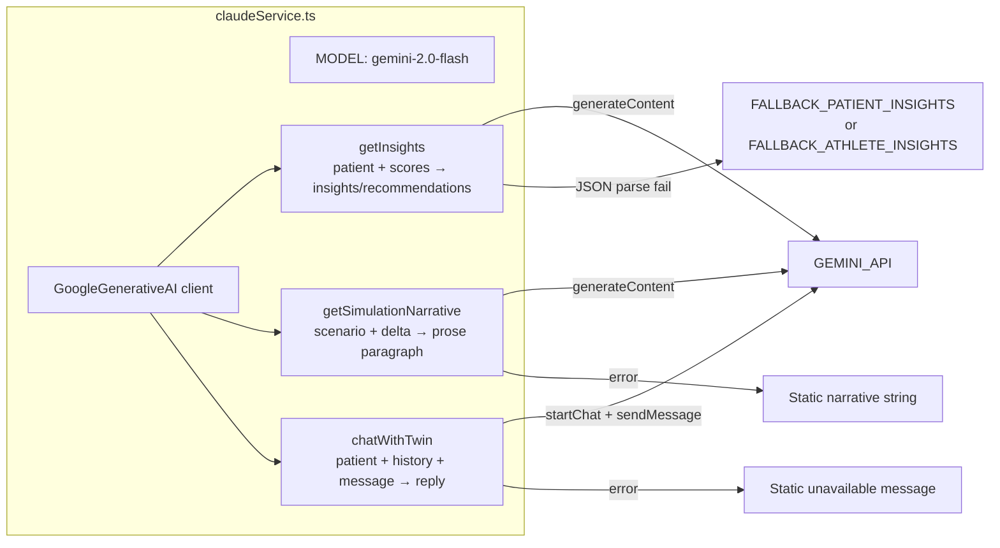

#### `getInsights(patient, scores)`
- Builds a rich clinical case summary string (vitals table, risk stratification table, clinical task instructions)
- Instructs Gemini to return **only valid JSON** with `insights[]` and `recommendations[]` (+ `causation_flags[]` for athlete)
- Parses with `stripMarkdownJSON()` to clean any code fence wrapping
- Falls back to hardcoded static insights on error

#### `getSimulationNarrative(scenario, delta, timeframe)`
- Sends a concise paragraph-generation prompt with the scenario name, risk delta summary, and timeframe
- Returns a plain-text narrative paragraph explaining the projected health outcome

#### `chatWithTwin(patient, analysis, history, message)`
- Uses `model.startChat({ history })` to maintain session context
- History is mapped: `assistant → 'model'`, `user → 'user'` (Gemini API role names)
- `systemInstruction` sets the Dr. Vita or Performance Health AI persona
- Returns the latest response text

#### Helper Functions
| Function | Purpose |
|----------|---------|
| `stripMarkdownJSON(text)` | Removes ` ```json ` fence wrappers from AI responses |
| `calculateBMI(weight, height)` | kg / (m²) calculation |
| `getReferenceFlag(value, low, high)` | Returns `⚠ LOW`, `⚠ HIGH`, or `✓ NORMAL` |
| `formatCycleStatus(current, total)` | Returns cycle progress with warning if >80% |

---

## 10. Database Schema

```mermaid
erDiagram
    User {
        string id PK
        string name
        string email UK
        string password
        datetime createdAt
    }
    Account {
        string id PK
        string userId FK
        string provider
        string providerAccountId
    }
    Session {
        string id PK
        string userId FK
        string sessionToken UK
        datetime expires
    }
    VerificationToken {
        string identifier
        string token UK
        datetime expires
    }
    HealthSession {
        string id PK
        string patientId UK
        string mode
        datetime createdAt
    }
    PatientRecord {
        string id PK
        string sessionId UK FK
        string mode
        json inputData
        datetime createdAt
    }
    Analysis {
        string id PK
        string sessionId FK
        json riskScores
        json insights
        datetime createdAt
    }

    User ||--o{ Account : "has"
    User ||--o{ Session : "has"
    HealthSession ||--o| PatientRecord : "has one"
    HealthSession ||--o{ Analysis : "has many"
```

### Data Persistence Strategy

- **HealthSession**: Identified by `patientId` (name-based slug). Uses `upsert` so re-analyzing the same patient updates rather than duplicates the session.
- **PatientRecord**: `upsert` by `sessionId` — always reflects the latest form input.
- **Analysis**: Appended with `create` on every analysis — provides full audit trail.
- **DB Errors are Non-Fatal**: The `/api/analyze` route wraps DB operations in an inner try-catch. If the DB is unreachable (e.g., Neon project paused), the analysis response is still returned to the client; only persistence fails silently.

---

## 11. Frontend Pages & Flows

### Landing Page (`/`)

```
Navbar → Hero → DataTwin → Features → HowItWorks → Marquee → Footer
```
Marketing page. No auth required.

---

### Registration & Login (`/register`, `/login`)

```mermaid
flowchart LR
    REG[/register] -->|Submit form| API_REG[POST /api/auth/register]
    API_REG -->|hash password, create user| DB[(Neon DB)]
    DB -->|success| LGN[/login]
    LGN -->|NextAuth credentials signIn| API_NEXT[POST /api/auth/callback/credentials]
    API_NEXT -->|create session| STORE[patientStore mode select]
    STORE -->|isAthlete = false| FORM[PatientForm /register?step=form]
    STORE -->|isAthlete = true| ATH_FORM[AthleteForm /athlete]
```

---

### Patient & Athlete Intake Form (`/register`)

Multi-section form using `PatientForm.tsx`:
- **Section 1**: Personal info (name, age, gender, height, weight)
- **Section 2**: Vitals (BP, glucose, cholesterol panel)
- **Section 3**: Lifestyle (smoking, alcohol, exercise, family history)
- **Section 4**: Existing conditions + medications

On submit:
1. `setPatient(formData)` to store
2. `fetch('POST /api/analyze', patient)` 
3. `setAnalysis(response)` to store
4. Redirect to `/dashboard` or `/simulator`

---

### Simulator Page (`/simulator`)

```mermaid
flowchart TD
    LOAD[Page Load] --> CHECK{Simulation\nin store?}
    CHECK -->|Yes| RESTORE[Restore previous sim state]
    CHECK -->|No| USE_BASE[Use baseline from analysis]

    USER[User adjusts sliders\ncal, carb, sodium, sleep, etc.] --> SYNC[useEffect syncs to simulationParams in store]

    BTN[Run Simulation button] --> BUILD[Build modifiedPatient from\ncurrent slider state]
    BUILD --> POST[POST /api/simulate\n{ patient, scenario: 'custom', modifiedPatient }]
    POST --> RE[riskEngine: original + projected risks]
    POST --> GEM[Gemini: narrative paragraph]
    POST --> RESP[SimulateResponse]
    RESP --> STORE[setSimulation in store]
    STORE --> UI[Render DeltaComparison + RiskGauges + Narrative]
```

**Persistence**: All slider values (`simulationParams`) sync to Zustand on every change via `useEffect`. Navigation away and back restores the last slider positions.

---

### Chat Page (`/chat`)

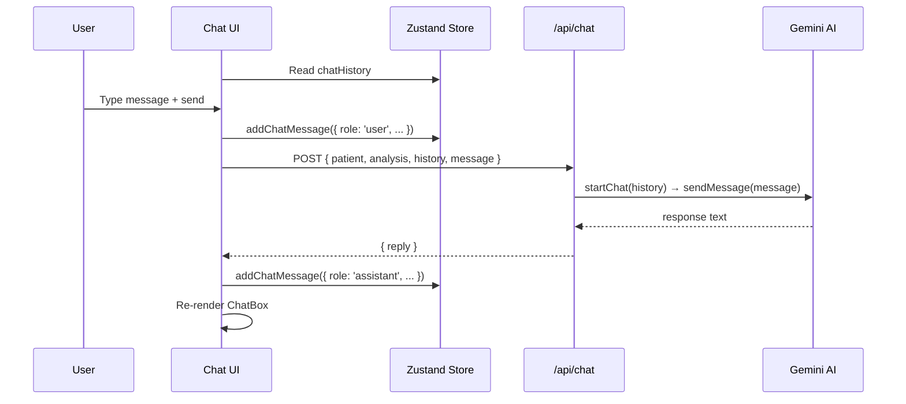

The initial welcome message is generated inline from live store data (patient name, glucose, BP values). Chat history persists across page navigations via Zustand.

---

### Account Page (`/account`)

Tabbed interface with 8 sections:
1. **Profile** — Edit name, age, height, weight, gender. Saves via `updatePatient()`
2. **Metrics** — Displays current biomarker summary table
3. **Reports** — PDF upload + Clinical Dossier print export
4. **Settings** — Language toggle + AI parameter toggles
5. **Notifications** — Placeholder
6. **Devices** — Placeholder
7. **Privacy** — Placeholder
8. **Billing** — Placeholder

**PDF Upload Flow**:
1. User clicks "Scan/Upload New PDF" → hidden file input opens
2. `FileReader` reads PDF as `base64`
3. `POST /api/extract` with `{ pdf_base64, mode }`
4. Anthropic Claude Vision extracts all medical values
5. `setPatient({ ...patient, ...extracted_fields })` merges into store

**Print/Export**:
- `window.print()` triggers the `@media print` CSS layer
- `.no-print` elements (sidebar, topbar) are hidden
- `.print-only.clinical-report` becomes visible — this is a full formatted clinical dossier
- Includes: Patient profile, risk stratification, clinical intelligence summary

---

## 12. Component Architecture

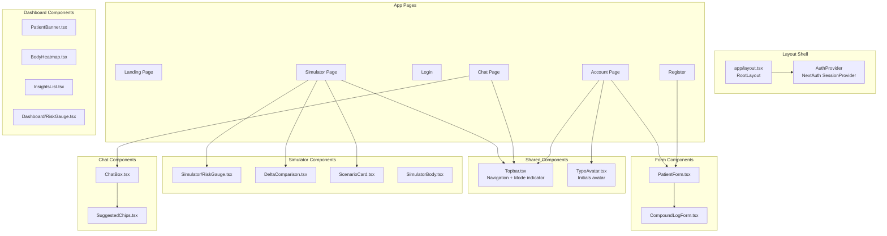

### `RiskGauge` — Two Variants

| Component | Location | Used In |
|-----------|----------|---------|
| `Dashboard/RiskGauge.tsx` | Circular SVG arc gauge | Dashboard analysis view |
| `Simulator/RiskGauge.tsx` | Side-by-side before/after gauge | Simulator results |

**Simulator `RiskGauge` Props**:
```typescript
interface RiskGaugeProps {
  label: string
  currentScore: number        // Projected (after scenario)
  baselineScore: number       // Original (before scenario)
  unit: string
  status: 'LOW RISK' | 'MODERATE' | 'HIGH' | 'CONTROLLED' | 
          'NORMAL' | 'ELEVATED' | 'STABLE' | 'CRITICAL' | 'STRESSED'
  color: string
}
```

---

## 13. Data Flow Diagrams

### Full Analysis Pipeline

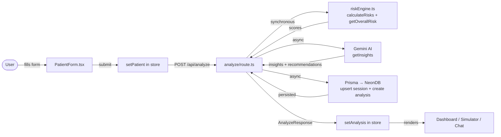

### Simulation Data Flow

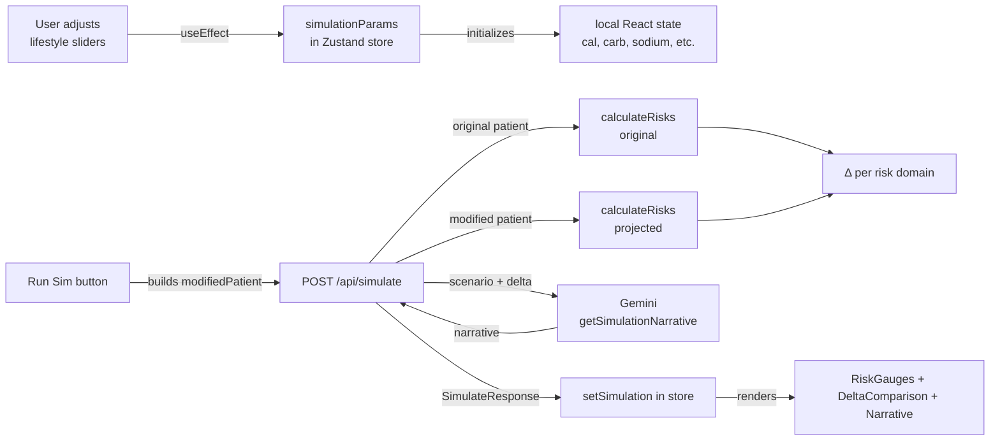

---

## 14. Authentication Flow

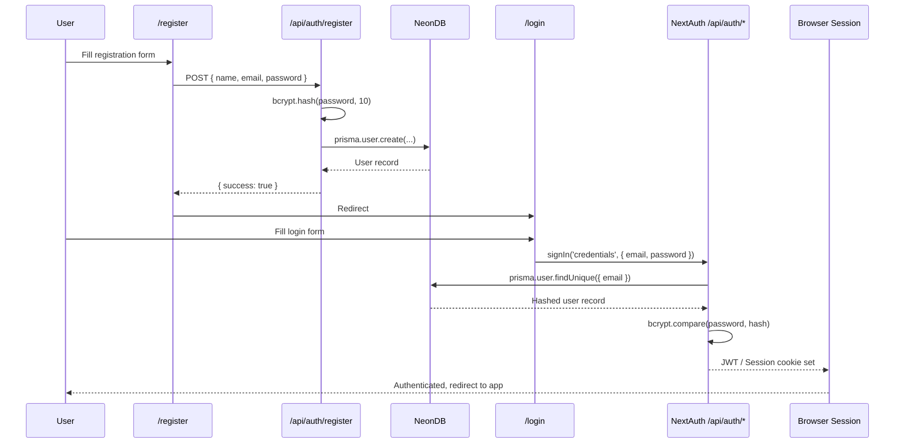

**Session Strategy**: JWT-based sessions via NextAuth. The Prisma adapter handles `Account`, `Session`, and `VerificationToken` models for OAuth providers.

---

## 15. Internationalization

VitaNomy supports 4 languages via `locales/translations.ts`.

| Code | Language |
|------|----------|
| `en` | English (default) |
| `hi` | Hindi |
| `ta` | Tamil |
| `te` | Telugu |

Language is stored in Zustand (`language`) and persisted to `localStorage`. The `useTranslation()` hook reads from the store and returns the correct translation object.

**Usage in components**:
```typescript
const { t } = useTranslation()
// t.account.title, t.dashboard.beginIntake, etc.
```

---

## 16. Environment Variables

| Variable | Required For | Description |
|----------|-------------|-------------|
| `DATABASE_URL` | Always | Neon PostgreSQL connection string |
| `NEXTAUTH_SECRET` | Always | NextAuth JWT signing secret |
| `NEXTAUTH_URL` | Always | Canonical app URL (e.g., `http://localhost:3000`) |
| `GEMINI_API_KEY` | Insights, Chat, Simulation | Google Gemini AI API key |
| `ANTHROPIC_API_KEY` | PDF Extraction only | Anthropic Claude API key (for `api/extract`) |

**`.env.local` Template**:
```env
DATABASE_URL="postgresql://..."
NEXTAUTH_SECRET="your-secret-here"
NEXTAUTH_URL="http://localhost:3000"
GEMINI_API_KEY="your-gemini-key-here"
ANTHROPIC_API_KEY="your-anthropic-key-here"
```

---

## 17. Running the Project

### Prerequisites
- Node.js ≥ 18
- PostgreSQL database (Neon DB recommended)

### Setup

```bash
# 1. Install dependencies
npm install

# 2. Set up environment variables
# Copy the template above into .env.local

# 3. Push Prisma schema to database
npx prisma db push

# 4. Generate Prisma client
npx prisma generate

# 5. Run development server
npm run dev
```

### Windows PowerShell Note

If `npm` is blocked by execution policy:
```powershell
Set-ExecutionPolicy RemoteSigned -Scope CurrentUser
```

### Build for Production

```bash
npm run build
npm run start
```

---

## Design Language

VitaNomy uses a **Neo-Brutalist Clinical** aesthetic:
- **Color palette**: Forest green (`#1B5E3B`), Clinical gold (`#C9A84C`), Warm beige (`#F8F5EE`), Deep ink (`#0A0F0D`), Alert red (`#C0392B`)
- **Typography**: Geist Sans + Geist Mono (Google Fonts)
- **Borders**: Heavy 3–4px solid black borders with offset box shadows (`shadow-[4px_4px_0px_#000]`)
- **Motion**: Framer Motion for panel transitions, loading states, chat animations
- **3D**: React Three Fiber for body model visualization in athlete/simulator views

---

*VitaNomy v0.1.0 — Clinical Intelligence Platform*
